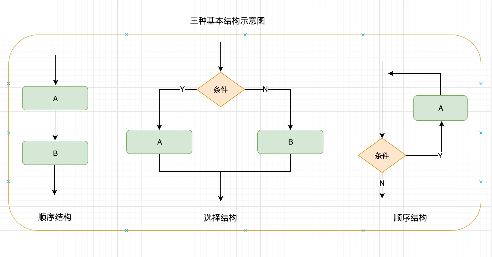

# 结构化程序设计

结构化程序设计（structured programming）是进行以模块功能和处理过程设计为主的详细设计的基本原则。结构化程序设计是过程式程序设计的一个子集，它对写入的程序使用逻辑结构，使得理解和修改更有效更容易。

## 三种基本程序结构

结构化程序设计的三种基本结构分别是：顺序结构、选择结构、循环结构



## 选择结构

选择结构分别包含：```if else```、```switch case```

**if else**

假设小明期末考试得了 80 分，根据 60分以下是不及格，60-69分是及格，70-89 是良好，90 以上是优秀，我们现在通过选择结构 **if else** 根据分数来给成绩定等级。

```c
#include <stdio.h>
int main() 
{
    int grade = 80;
    
    if (grade < 60) {
        printf("不及格");
    } else if (grade < 70) {
        printf("及格");
    } else if (grade < 90) {
        printf("良好");
    } else {
        printf("优秀");
    }
    
    return 0;
}
```

**switch case**

注意：case 之后是一个常量表达式，它必须是整数类型，如 int 或 char

```c
#include <stdio.h>
int main() 
{
    int day = -1;
    switch (day) {
        case 0:
            printf("星期天.\n"); break;
        case 1:
            printf("星期一.\n"); break;
        case 2:
            printf("星期二.\n"); break;
        case 3:
            printf("星期三.\n"); break;
        case 4:
            printf("星期四.\n"); break;
        case 5:
            printf("星期五.\n"); break;
        case 6:
            printf("星期六.\n"); break;
        default:
            printf("输入有误!.\n");
            break;
    }
    return 0;
}
```

## 循环结构

循环结构包含：```while```、```do while```、```for```

**while**

```c
#include <stdio.h>
int main() 
{
    int i = 0;
    while (i < 10) {
        i++;
        printf("%d ", i);
    }
    return 0;
}
```

**do while**

与 while 的区别是先执行代码块内容在判断是否合法。

```c
#include <stdio.h>
int main() 
{
    int i = 0;
    do {
        i++;
        printf("%d ", i);
    } while (i < 10);
    return 0;
}
```

**for**

for 循环语句相比上面两种更加灵活，使用起来也很简单，形式为：

```c
for (表达式1；表达式2；表达式3) {
    // 代码块
}
```

```c
#include <stdio.h>
int main() 
{
    for (int i=0; i<10; i++) {
        printf("%d ", i);
    }
    return 0;
}
```

## break 与 continue

**break 与 continue 区别**：break 是跳出当前整个循环，continue 结束本次循环开始下一次循环。 

**break**

运行以下程序，输出结果为：0 1 2 3 4，可以看到当循环到 i=5 时跳出了当前循环，之后的内容将不在执行。


```c
#include <stdio.h>
int main() 
{
    for (int i=0; i<10; i++) {
        if (i == 5) {
            break;
        }
        printf("%d ", i);
    }
    return 0;
}
```

**continue**

运行以下程序，输出结果为：0 1 2 3 4 6 7 8 9，可以看到当循环到 i=5 时结束了本次循环，后续内容并没有执行

```c
#include <stdio.h>
int main() 
{
    for (int i=0; i<10; i++) {
        if (i == 5) {
            continue;
        }
        printf("%d ", i);
    }
    return 0;
}
```